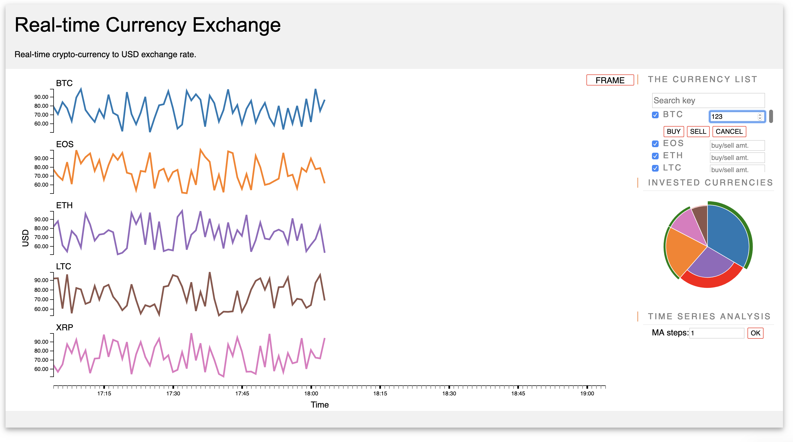

<h1>Real-time Currency Exchange</h1>

Real-time crypto-currency to USD exchange rate.

Live demo is available at: https://phamvanvung.github.io/V2A/
(This is the simulated version to have faster view of the data).
Change the code (in the data.js), to use the real-time version (data will be loaded from alphavantage.com for every single minute, and maximum 5 currencies per minute for free account).

If you would like to have more currencies to be monitored at a time you will need to apply for a fee from alphavantage.com.

 